<div align="center">

# Smart-Account Wallet UI Prototype

**A high-fidelity UI prototype for the ORYA smart-account wallet**

[](https://nextjs.org)
[](https://www.typescriptlang.org)
[]()

*The design exploration behind ORYA - dashboard, assets, send/receive, and chain switching.*

</div>

> **Available for development and custom work.** This is a working prototype / showcase. I can build and deliver the complete product - including the private production backend - or adapt it for your needs, under a development agreement (post-agreement fee). **Get in touch:** https://github.com/plinkdev1


> **Related:** smart-account backend -> [omnichain-smart-account-wallet](https://github.com/plinkdev1/omnichain-smart-account-wallet)

---

## What Is This?

This is the front-end UI prototype for the ORYA wallet - a focused exploration of the wallet experience: dashboard layout, asset list, send/receive flows, and chain switching. It's UI-led; the on-chain logic lives in the paired smart-account repo.

---

## Features

| Feature | Description | Status |
|---|---|:---:|
| Wallet dashboard | Balances and activity layout | ✅ |
| Asset list | Token holdings view | ✅ |
| Send / receive | Transfer screens | ✅ |
| Chain switcher | Switch between networks (UI) | ✅ |
| Live chain data | Real balances and prices | 🚧 |
| Wired transactions | Real on-chain sends | Roadmap |

---

## How It Works

```
Wallet dashboard
   ├─ Assets
   ├─ Send / Receive
   └─ Chain switcher
   (UI prototype - logic mocked)
```

---

## Tech Stack

| Layer | Technology |
|-------|------------|
| Frontend | Next.js, React, TypeScript |
| Styling | Tailwind CSS, shadcn/ui |

---

## Project Structure

```
smart-account-wallet-ui-prototype/
app/
   atrium/
   chains/
   curio/
   flow/
   grove/
   insights/
components/
   ui/
   balance-card.tsx
   care.tsx
   chain-slider.tsx
   circle.tsx
   hamburger-menu.tsx
contexts/
   theme-context.tsx
hooks/
   use-mobile.ts
   use-toast.ts
lib/
   utils.ts
public/
   abstract-cosmic-art.jpg
   apple-icon.png
   digital-abstract.png
   ethereal-waves.jpg
   icon-dark-32x32.png
   icon-light-32x32.png
styles/
   globals.css
.gitignore
components.json
next.config.mjs
next-env.d.ts
package.json
pnpm-lock.yaml
postcss.config.mjs
README.md
tsconfig.json
```

---

## Screenshots

<table>
<tr><td width="50%">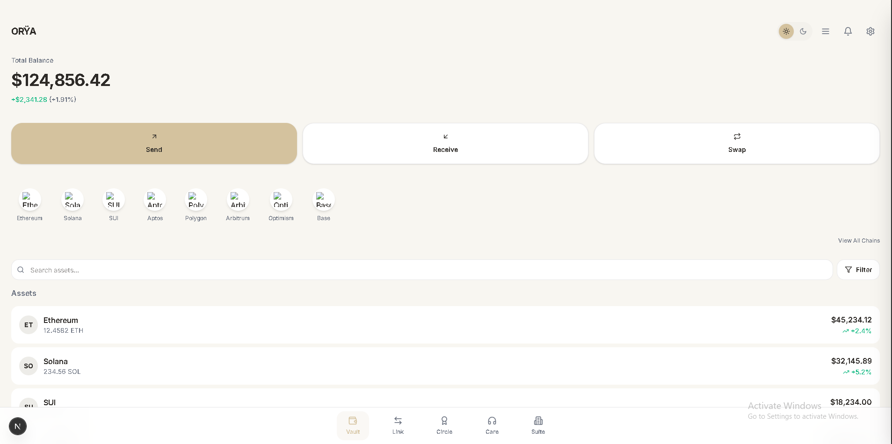</td><td width="50%">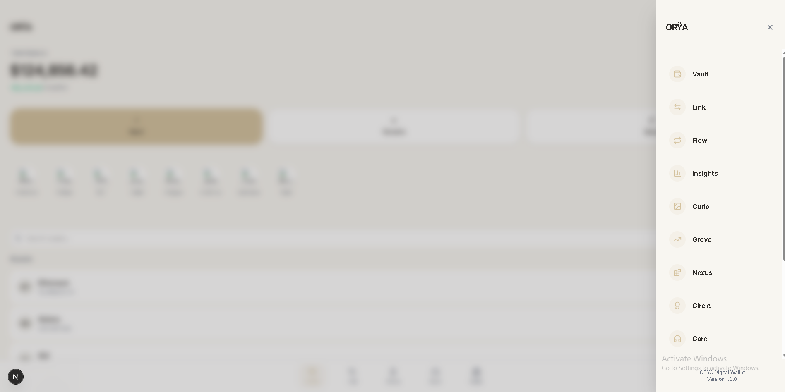</td></tr>
<tr><td width="50%">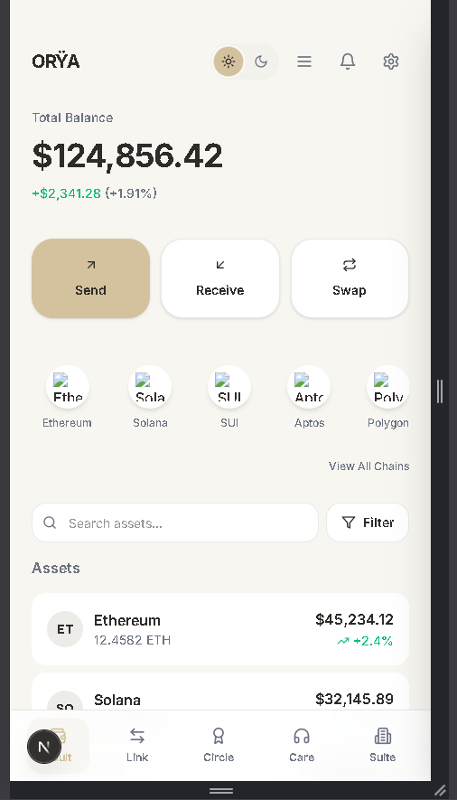</td><td width="50%">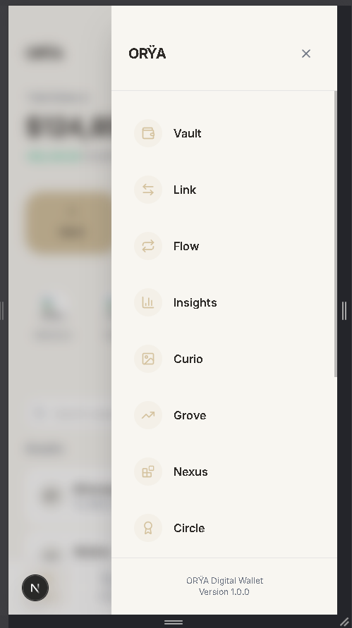</td></tr>
<tr><td width="50%">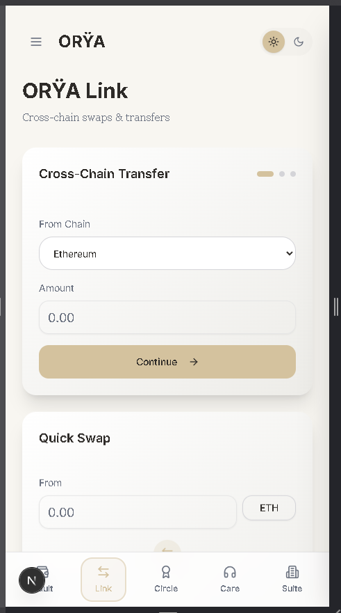</td><td width="50%">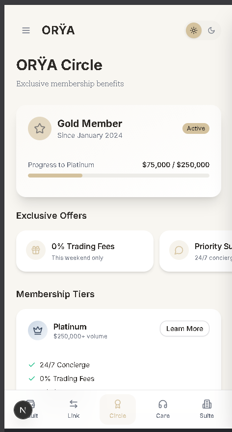</td></tr>
<tr><td width="50%">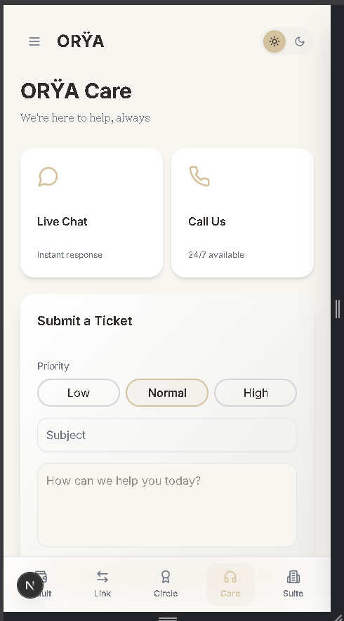</td><td width="50%">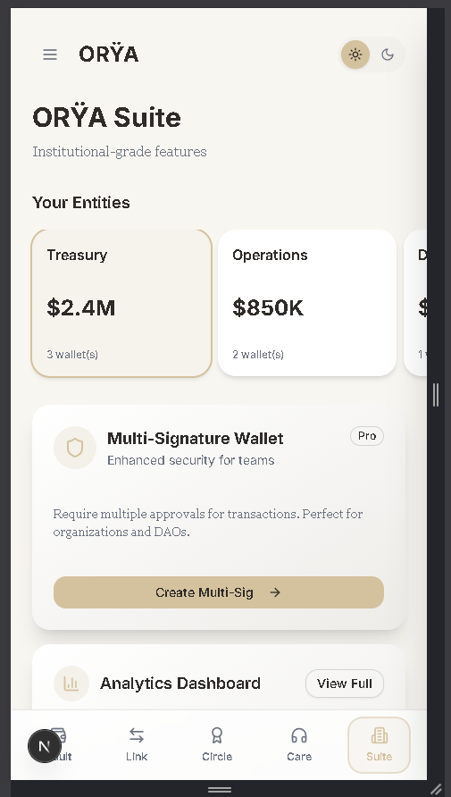</td></tr>
<tr><td width="50%">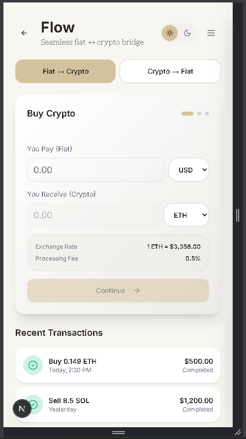</td><td width="50%">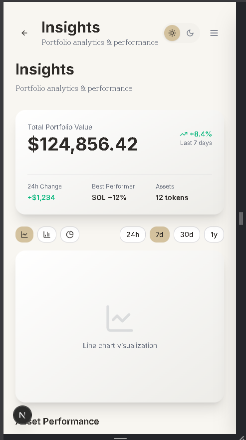</td></tr>
<tr><td width="50%">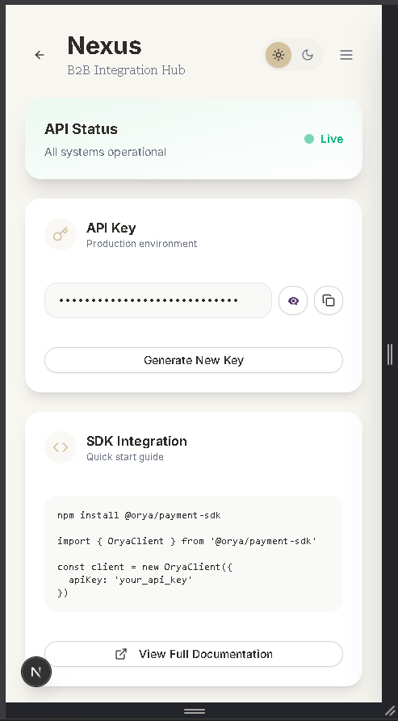</td><td width="50%">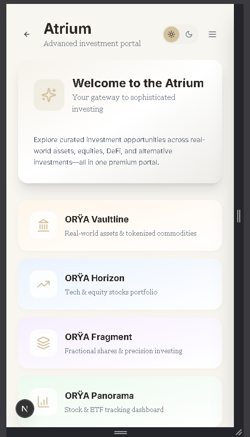</td></tr>
<tr><td width="50%">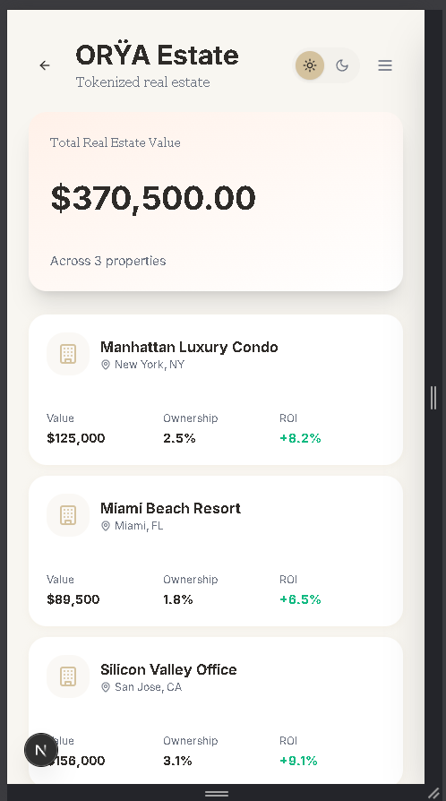</td></tr>
</table>

---

## Getting Started

```bash
npm install --legacy-peer-deps --ignore-scripts
npx next dev
```

---

## Notes

Shared as a portfolio artifact demonstrating product and UX design. UI prototype - logic is mocked. The on-chain backend lives in [omnichain-smart-account-wallet](https://github.com/plinkdev1/omnichain-smart-account-wallet).

<div align="center">

MIT

</div>
